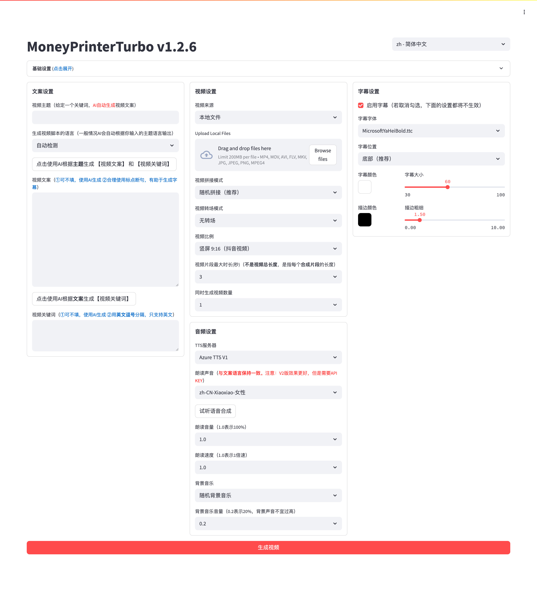

<div align="center">
<h1 align="center">MoneyPrinterTurbo 💸</h1>

<p align="center">
  <a href="https://github.com/cresus-ui/vidrush/stargazers"></a>
  <a href="https://github.com/cresus-ui/vidrush/issues"></a>
  <a href="https://github.com/cresus-ui/vidrush/network/members"></a>
  <a href="https://github.com/cresus-ui/vidrush/blob/main/LICENSE"></a>
</p>
<br>
<h3>Français | <a href="README-en.md">English</a> | <a href="README-zh.md">简体中文</a></h3>
<div align="center">
  <a href="https://trendshift.io/repositories/8731" target="_blank"></a>
</div>
<br>
Fournissez simplement un <b>sujet</b> ou un <b>mot-clé</b> pour une vidéo, et l'outil générera automatiquement le script, les matériaux vidéo, les sous-titres et la musique de fond avant de synthétiser une vidéo courte haute définition.
<br>

<h4>Interface Web</h4>



<h4>Interface API</h4>


</div>

## Fonctionnalités 🎯

- [x] Architecture **MVC** complète, code **clair** et facile à maintenir, supporte `API` et `Interface Web`
- [x] Support de la **génération automatique par IA** du script vidéo, ou **script personnalisé**
- [x] Support de plusieurs tailles de **vidéo HD**
    - [x] Portrait 9:16 (`1080x1920`)
    - [x] Paysage 16:9 (`1920x1080`)
- [x] Support de la **génération de vidéos par lots**
- [x] Réglage de la **durée des clips**, pour ajuster la fréquence de changement de scène
- [x] Support des scripts en **Chinois** et **Anglais**
- [x] Support de **plusieurs voix** de synthèse, avec **aperçu en temps réel**
- [x] Support de la **génération de sous-titres** avec réglage de `police`, `position`, `couleur`, `taille` et `contour`
- [x] Support de la **musique de fond** (aléatoire ou spécifique) avec réglage du volume
- [x] Matériaux vidéo **HD** et **libres de droits**, ou utilisation de vos **matériaux locaux**
- [x] Support de nombreux modèles : **OpenAI**, **Moonshot**, **Azure**, **gpt4free**, **one-api**, **Qwen**, **Google Gemini**, **Ollama**, **DeepSeek**, **MiniMax**, **ERNIE**, **Pollinations**, **ModelScope**, etc.

## Démonstrations Vidéo 📺

### Portrait 9:16

| ▶️ Comment ajouter du plaisir à votre vie | ▶️ Le rôle de l'argent | ▶️ Quel est le sens de la vie |
| :---: | :---: | :---: |
| <video src="https://github.com/cresus-ui/vidrush/assets/4928832/a84d33d5-27a2-4aba-8fd0-9fb2bd91c6a6"></video> | <video src="https://github.com/cresus-ui/vidrush/assets/4928832/af2f3b0b-002e-49fe-b161-18ba91c055e8"></video> | <video src="https://github.com/cresus-ui/vidrush/assets/4928832/112c9564-d52b-4472-99ad-970b75f66476"></video> |

## Configuration Requise 📦

- Systèmes conseillés : Windows 10+, macOS 11.0+, ou distributions Linux majeures
- GPU non requis mais recommandé pour une transcription locale plus rapide

| Élément | Minimum | Recommandé | Idéal |
| --- | --- | --- | --- |
| CPU | 4 cœurs | 6 à 8 cœurs | 8 cœurs et + |
| RAM | 4 Go | 8 Go | 16 Go et + |
| GPU | Optionnel | 4 Go VRAM + | 8 Go VRAM + |

## Démarrage Rapide 🚀

### Utilisation Recommandée

- Utilisateurs Windows : Utilisez le pack prêt à l'emploi (One-click)
- Utilisateurs MacOS / Linux : Utilisez `uv sync --frozen` pour un déploiement local
- Environnement isolé : Utilisez Docker

### Exécuter dans Google Colab
Évitez la configuration locale, cliquez pour tester directement dans Google Colab :

[](https://colab.research.google.com/github/cresus-ui/vidrush/blob/main/docs/MoneyPrinterTurbo.ipynb)

## Installation et Déploiement 📥

### Prérequis

- Évitez les chemins avec des caractères spéciaux ou espaces
- Assurez-vous que votre connexion réseau est stable

#### ① Cloner le projet

```shell
git clone https://github.com/cresus-ui/vidrush.git
```

#### ② Modifier la configuration

- Copiez `config.example.toml` en `config.toml`
- Configurez vos clés API pour Pexels et votre fournisseur LLM préféré

### Déploiement Docker 🐳

```shell
cd MoneyPrinterTurbo
docker-compose up
```

L'interface sera accessible sur http://localhost:8501

### Déploiement Manuel 📦

#### ① Créer un environnement virtuel

```shell
uv python install 3.11
uv sync --frozen
```

#### ② Lancer l'interface Web 🌐

```shell
uv run streamlit run ./webui/Main.py --browser.gatherUsageStats=False
```
